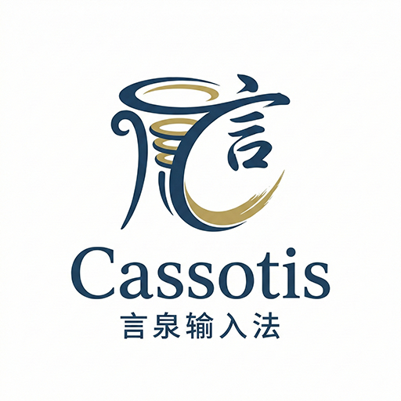

# Cassotis Lexicon

<p align="center">
  
</p>

<p align="center">
  <a href="LICENSE"></a>
</p>

[English](README.md) | 简体中文

Cassotis IME 的词库构建与发布仓库。

## 仓库职责
- 维护词库构建脚本、清单文件和生成产物。
- 发布供 Cassotis IME 使用的版本化词库和本地语言模型产物。
- 支持外部来源引导构建和可复现的生成词库构建流程。
- 保持署名文件与生成产物一致。

## 当前词库快照（2026-07-25 构建）

| 文件 | 变体 | 词条数 |
|------|------|--------|
| `data/generated/dict_clean_sc.txt` | 简体主词库 | 188,047 |
| `data/generated/dict_clean_tc.txt` | 繁体主词库 | 191,121 |
| `data/generated/dict_unihan_sc.txt` | 简体单字（Unihan） | 23,907 |
| `data/generated/dict_unihan_tc.txt` | 繁体单字（Unihan） | 24,167 |

## 本地排序模型数据与 AI 重排支持

Cassotis Lexicon 在词汇词库之外还发布本地排序模型产物：查询路径先验在 v1.0.0 已经提供，v1.1.0 起进一步加入语料训练得到的本地统计语言模型数据。这些产物用于增强长句和短词的上下文排序能力，而不是大幅增加可直接输入的词条数量。

| Version | 查询路径先验（简体 / 繁体） | 词路径转移关系（简体 / 繁体） | 字符 n-gram 参数（简体 / 繁体） |
|---|---:|---:|---:|
| `v1.4.0` | 23,544 / 22,696 | 152,729 / 145,284 | 698,695 / 698,778 |
| `v1.3.0` | 23,541 / 22,676 | 152,729 / 145,284 | 698,695 / 698,778 |
| `v1.2.0` | 23,529 / 22,663 | 152,729 / 145,284 | 698,695 / 698,778 |
| `v1.1.0` | 23,521 / 22,655 | 152,729 / 145,284 | 558,645 / 559,128 |
| `v1.0.0` | 23,518 / 22,653 | — | — |

以上记录不是可直接输入的词条，因此不计入前述词库快照。查询路径先验和词级二元、三元转移关系由 Lexicon 构建流程生成；带平滑回退的字符级 n-gram 模型由 IME 训练工具生成，再由本仓库统一版本化和发布。Cassotis IME 会将这些产物导入本地 SQLite 词库，用于长句 lattice/N-best 路径打分；从 v1.4.0 开始，字符 n-gram 还会作为处理短词精确候选歧义的上下文信号。

从 Cassotis IME v1.3.0 开始，这些词库约束和统计信号还会支持项目首个可部署的长句神经残差重排器。紧凑的神经模型本体由 IME 项目训练、导出和部署，因此不计入可输入词条数量，也不计入上表的模型数据规模。v1.3.0 的词路径转移关系和字符 n-gram 数量与 v1.2.0 相同是正常结果。

Cassotis IME v1.4.0 新增独立的短词上下文重排器，并复用本仓库发布的字符 n-gram 信号。这个紧凑模型同样由 IME 项目训练、导出和部署，因此不会在上表中增加新的模型数据类别。

统计模型只保存短距离词语转移和字符 n-gram，不保存完整训练句子。独立的长句和短词基准案例均不参与训练。运行时，IME 在本地计算统计信号并执行紧凑的原生重排器，不会启动 PyTorch/ONNX 运行环境或外部模型服务，也不需要联网或 GPU。长句评测方法见 [IME 基准测试说明](https://github.com/shenmin/cassotis-ime/blob/master/BENCHMARK.CN.md)。

## 外部来源与项目维护补充层（`external_broad`）

### 外部来源

| 来源 | 许可证 | 用途 |
|------|--------|------|
| Unicode Unihan | Unicode-3.0 | 单字级普通话回退与单字词库 |
| CC-CEDICT | CC BY-SA 4.0 | 核心词库词条与拼音 |
| OpenCC STPhrases | Apache-2.0 | 简繁短语映射 |
| THUOCL | THUOCL custom open terms | 扩展覆盖与 DF 统计信号 |
| jieba `dict.txt` | MIT | 频率排序信号 |
| Wiktionary 中文标题（ns0） | CC BY-SA 4.0 | 日常表达、口语短语和聊天类词汇种子 |
| Wikipedia 中文标题（ns0） | CC BY-SA 4.0 | 专名覆盖与高置信专有名词种子 |
| Wikimedia Pageviews Top（zh.wikipedia） | CC BY-SA 4.0 | 真实世界热度信号 |
| Wikidata 中文历史人物 | CC0-1.0 | 以保守权重导入独立人名层的知名历史人物补充 |
| 过滤后的 `THUOCL_IT` 子集 | THUOCL custom open terms | 计算机 vertical 候选来源，导入前过滤，避免与日常/聊天词层混在一起 |
| 过滤后的 `THUOCL_chengyu` 子集 | THUOCL custom open terms | 成语典故 vertical 候选来源，过滤后以保守权重使用，让完整成语输入可候选但不挤占日常短语 |
| Getty AAT 中文建筑术语 | ODC-By 1.0 | 以保守方式导入 architecture-terms layer 的官方建筑术语来源 |
| Wikidata 中文建筑构件 / 风格 / 建筑地标 | CC0-1.0 | 导入隔离式 architecture vertical 的建筑术语与建筑地标补充来源 |
| Wikidata 中文国家 / 主要城市 / 行政区 / 旅游地标 | CC0-1.0 | 以保守权重补充国家、地区、世界主要城市、行政地名、景点和地标 |
| Wikidata 中文电子游戏 / 系列 / 类型 / 主机 | CC0-1.0 | 隔离式 gaming vertical 的主实体来源 |
| 过滤后的 Wiktionary / Wikipedia 中文游戏词条标题 | CC BY-SA 4.0 | 以保守方式导入 gaming vertical 的轻量词汇补充 |
| Godot Docs zh-cn 标题索引 | CC BY 3.0 | game-development vertical 的主术语来源，导入前经过过滤 |
| Wikidata 中文游戏引擎 | CC0-1.0 | game-development vertical 的游戏引擎实体补充 |
| MeSH descriptor catalog | NLM MeSH terms and conditions | 医学 vertical 的 MeSH 概念白名单 |
| Wikidata 中文医学实体（MeSH 关联） | CC0-1.0 | 作为医学实体主层导入的中文医学标签与别名 |
| 过滤后的 `THUOCL_medical` 子集 | THUOCL custom open terms | 医学 vertical 候选来源，过滤后并以比 MeSH 主层更保守的权重使用 |

### 项目维护补充层

| 补充层 | 许可证 | 用途 |
|--------|--------|------|
| Cassotis 日常/聊天短语补充 | 仓库许可证（项目自编写） | 对高价值的日常/聊天表达做稳定补充，弥补公开来源遗漏 |
| Cassotis 低频日常补充 | 仓库许可证（项目自编写） | 保留有用的 exact 候选，但使用带上限的低频权重，避免挤占更强的常用词 |
| Cassotis 词条级拼音覆盖 | 仓库许可证（项目自编写） | 项目维护的多音词读音覆盖表，在来源融合后压制所有层中由单字兜底生成的错误读音 |
| Cassotis 小说实体补充 | 仓库许可证（项目自编写） | 项目维护的小说人物、作品名和世界观实体列表，与日常/聊天词及一般专名隔离 |
| Cassotis 一般专名补充 | 仓库许可证（项目自编写） | 项目维护的非人名专名列表，覆盖头衔、组织、品牌、平台、产品等现实命名实体，不与日常/聊天优先路径混用 |
| Cassotis 人名补充 | 仓库许可证（项目自编写） | 项目维护的当代知名人物与历史人物列表，带显式拼音修正，并与日常/聊天短语和非人名专名隔离 |
| Cassotis 地名 / 国家地区 / 城市 / 地标补充 | 仓库许可证（项目自编写） | 隔离式 `place_names` vertical 使用的项目维护低优先级地名列表，并为多音/易错的国内外地名、国家地区、世界城市和地标提供显式拼音修正 |
| Cassotis 成语典故补充 | 仓库许可证（项目自编写） | 项目维护的高价值成语与文学典故列表，与日常/聊天短语排序路径隔离 |
| Cassotis 计算机术语补充 | 仓库许可证（项目自编写） | 隔离式 computing vertical 使用的项目维护计算机/领域术语列表 |
| Cassotis 政务民生术语补充 | 仓库许可证（项目自编写） | 面向税务、房产、户籍和公共服务场景的隔离式 civic vertical 术语层，不走日常/聊天优先路径 |
| Cassotis 建筑术语补充 | 仓库许可证（项目自编写） | 隔离式 architecture-terms layer 使用的项目维护建筑术语补充 |
| Cassotis 建筑实体补充 | 仓库许可证（项目自编写） | 隔离式 architecture-entities layer 使用的项目维护建筑实体补充 |
| Cassotis 游戏术语补充 | 仓库许可证（项目自编写） | 隔离式 gaming vertical 使用的项目维护游戏术语补充 |
| Cassotis 游戏开发术语补充 | 仓库许可证（项目自编写） | 隔离式 game-development vertical 使用的项目维护术语补充 |
| Cassotis 医学术语补充 | 仓库许可证（项目自编写） | 用于高价值医学词汇和显式拼音修正的项目维护医学补充层，与日常/聊天优先路径隔离 |

参见：
- `manifests/sources.public.yml`
- `attribution/ATTRIBUTION.md`

## 导入后的优化与过滤（外部来源）
- 统一并去重来自不同来源格式的词条。
- 综合多个信号（基础频率、DF/频率侧信号、页面热度）计算权重，并做平衡缩放。
- 从已被支持的长口语表达中派生更短的日常/聊天前缀，让常见句式转折更容易前排出现。
- 压低低信号专名、疑似人名和长尾噪声，减少冷门专名挤占常用词位置。
- 应用面向 IME 的有效性过滤（例如可显示性与字符脚本约束），保证输出适合主流 Windows 客户端。
- 通过规则修正与回归样本校验保持排序行为稳定。

## 覆盖重点
- 优先改善日常表达和对话式输入，不只追逐热点词。
- 借助开放词汇来源补回常见短表达、句式转折、语气词和口语连接词。
- 对开放来源仍然缺失但价值很高的日常表达，保留少量项目维护白名单。
- 将专名和网页热点作为次级信号，避免它们主导核心日常输入路径。

## 分层策略
- `manifests/curated_daily_phrases.tsv` 只用于应获得日常输入优待的日常/聊天表达。
- `manifests/curated_daily_supplement_phrases.tsv` 用于低频日常补充：保证完整输入可候选，但不继承日常/聊天短语的高优先级权重。
- `manifests/vertical_layers.public.json` 声明隔离式 vertical 术语层。
- `manifests/vertical/*.tsv` 存放项目维护的 vertical 词表，例如小说实体、一般专名、人名、地名、国家地区、世界城市、地标、成语典故、计算机术语、政务民生术语、建筑术语/建筑实体、游戏术语和游戏开发术语。
- vertical 层可以补充领域词汇，但不会继承日常/聊天短语的优待偏置。
- fiction 层将小说人物、作品名和世界观实体与日常/聊天表达及一般专名隔离。
- active 的 proper-noun 层将非人名头衔、组织、品牌、平台、产品和一般现实专名与日常/聊天表达隔离。
- people-name 层将知名人物与历史人物姓名和日常/聊天表达、小说实体、非人名专名隔离；Wikidata 补充的人名会刻意使用保守权重，让完整姓名输入可候选但不挤占常用词。
- place-name 层以保守权重保留常见国内外地名、国家地区、世界主要城市、景点和地标，让完整地名输入可候选，但不挤占日常词候选。
- Wikidata 补充的地名词条会刻意低于项目维护词条；冷门行政区和冷门地标应当能在完整输入时出现，但不应压过常用词。
- idioms-allusions 层目前结合了过滤后的 `THUOCL_chengyu` 子集与项目维护成语典故，用保守权重保证完整成语输入可候选，但不继承日常/聊天短语的优待偏置。
- computing 层目前结合了过滤后的 `THUOCL_IT` 子集与项目维护计算机术语。
- civic 层目前承载税务、房产、户籍及其他公共服务术语。
- architecture-terms 层目前结合了项目维护建筑术语、Getty AAT 建筑术语，以及 Wikidata 建筑构件/风格补充。
- architecture-entities 层目前结合了项目维护建筑实体，以及保守导入的 Wikidata 建筑地标补充。
- gaming 层目前结合了项目维护游戏术语、Wikidata 游戏实体和过滤后的 zhwiki/zhwiktionary 游戏词汇标题。
- game-development 层目前结合了项目维护游戏开发术语、过滤后的 Godot 文档标题、Wikidata 游戏引擎补充，以及过滤后的 zhwiki/zhwiktionary 游戏开发词汇标题。
- medicine 层目前结合了项目维护医学术语、MeSH 描述符目录、MeSH 关联 Wikidata 医学实体，以及过滤后的 `THUOCL_medical` 子集，并始终与日常/聊天优先路径隔离。

## 目录结构
- `data/generated/`：生成的词库文件和版本化语言模型产物。
- `manifests/`：来源/许可证清单与回归样本。
- `manifests/pinyin_overrides.tsv`：项目维护的词条级读音覆盖表。
- `manifests/vertical/`：项目维护的隔离式 vertical 词表。
- `scripts/`：构建、校验和导出辅助脚本。
- `reports/`：构建报告。
- `rules/`：导出与发布规则。

## 构建与校验

```powershell
# 全量重建（external_broad + unihan_single + regression checks）
.\rebuild_all.ps1

# 可选：生成待人工审核的人名候选；不会自动导入正式词库
.\scripts\build_people_names_candidates.ps1

# 直接构建单个 profile
.\scripts\build_external_seed.ps1 -Profile external_broad
```

`external_broad` 和 `external_cedict` 在存在
`manifests/vertical_layers.public.json` 时会自动加载它。
